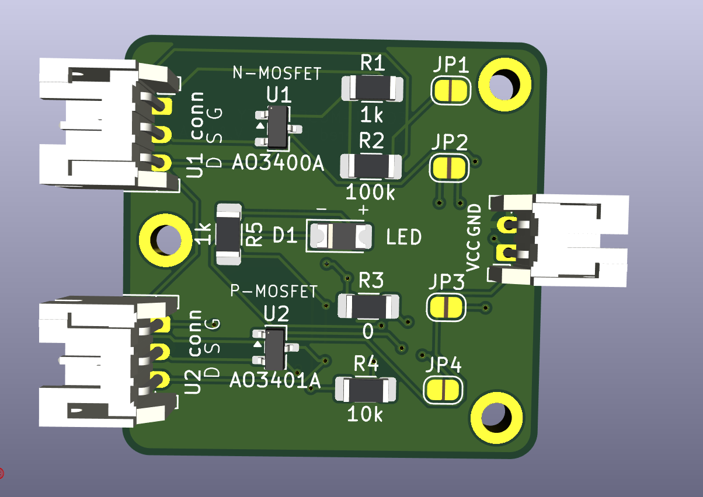
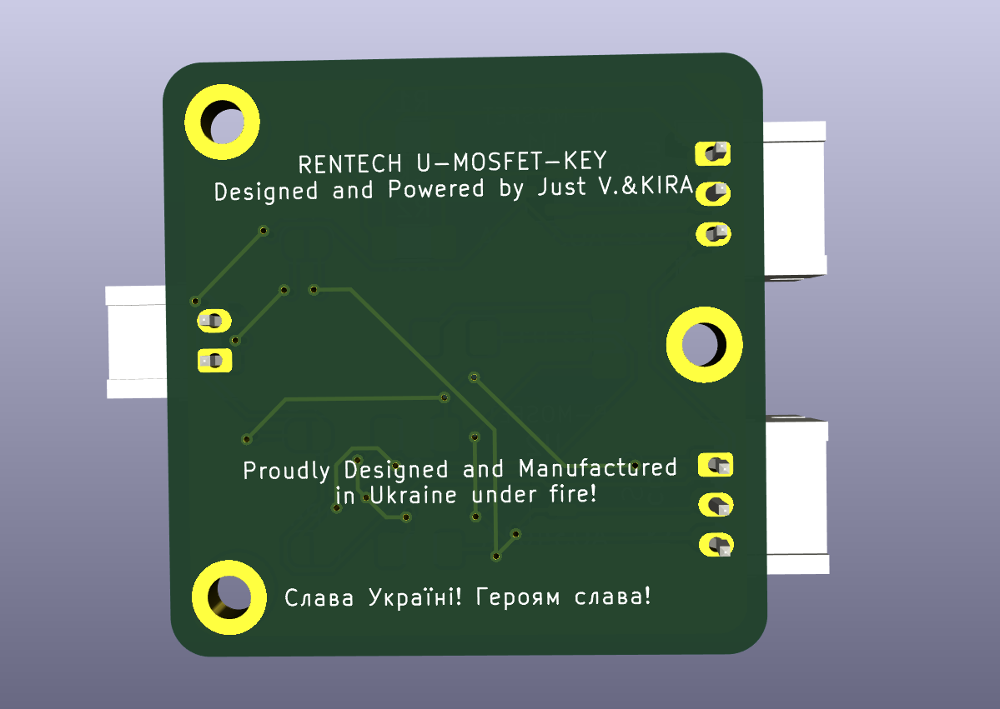

# Слава Україні, козацтво!
# UNIVERSAL MOSFET KEY PCB — REV-A

  

  

# DISCLAIMER: Oct-3rd 2026. AWAITING MANUFACTURE FOR HARDWARE VERIFICATION! \ 3 Жовтня 2026. Чекає на друк для підтвердження фізичної придатності!

# Key Feature from my POV: PCB dimensions are 30x30mm, which makes it suitable for smail DIY embedded devices\IoT
# Ключова для мене фіча, що приймалась за основу при розробці - малі габарити 30х30мм, що робить її зручною для використання в маленьких embedded-самодєлках.

Compact configurable MOSFET carrier board for small power-switching and control applications.

REV-A combines two configurable MOSFET stages on one PCB:

- U1 — N-channel MOSFET
- U2 — P-channel MOSFET

The stages may be used independently or linked together using solder jumpers.

Typical applications:

- touch-controlled power switch;
- high-side power switching;
- TP4056 input power control;
- standalone low-side N-MOSFET switching;
- status / power indication;
- small embedded power-control circuits.

The board uses commonly available SOT-23 MOSFETs, 1206 passive components and optional JST-PH 2.0 mm connectors.

---

## Hardware

### MOSFETs

U1 — N-MOSFET:
- AO3400A
- IRLML6344
- or another electrically compatible SOT-23 N-channel MOSFET

U2 — P-MOSFET:
- AO3401A
- or another electrically compatible SOT-23 P-channel MOSFET

For the devices used in this project:

1 = Gate  
2 = Source  
3 = Drain

### Passive components

- R1–R5 — 1206
- D1 — LED 1206
- JP1–JP4 — normally-open solder jumpers

### Connectors

The PCB provides optional JST-PH 2.0 mm footprints.

POWER:

| Pin | Signal |
| --- | --- |
| 1 | VCC |
| 2 | GND |

N-MOS:

| Pin | Signal |
| --- | --- |
| 1 | N-CTRL |
| 2 | N-IN |
| 3 | N-OUT |

P-MOS:

| Pin | Signal |
| --- | --- |
| 1 | P-CTRL |
| 2 | P-IN |
| 3 | P-OUT |

The JST connectors are optional. They may be left unpopulated and the pads may be used for direct wiring.

---

## Circuit structure

### N-MOS stage

N-CTRL → R1 → Gate U1

R2 connects Gate U1 to Source U1.

Source U1 = N-IN  
Drain U1 = N-OUT

Therefore:

N-CTRL → R1 → N-GATE  
N-GATE → Gate U1  
N-GATE → R2 → N-IN  
N-IN → Source U1  
N-OUT → Drain U1

### P-MOS stage

P-CTRL → R3 → Gate U2

R4 connects Gate U2 to Source U2.

Source U2 = P-IN  
Drain U2 = P-OUT

Therefore:

P-CTRL → R3 → P-GATE  
P-GATE → Gate U2  
P-GATE → R4 → P-IN  
P-IN → Source U2  
P-OUT → Drain U2

### Status LED

P-OUT → R5 → D1 → JP4 → GND

D1 polarity:

Anode = +  
Cathode = -

The onboard LED is intended as a status / power indicator, not as a high-power lighting output.

---

# Solder jumper configuration

All four jumpers are normally OPEN.

## JP1 — N-IN to GND

JP1 connects:

N-IN ↔ GND

Close JP1 when U1 is used as a conventional low-side N-MOSFET switch referenced to board ground.

JP1 CLOSED:

N-IN = GND

Typical low-side connection:

Load positive → power supply positive  
Load negative → N-OUT  
U1 Source → N-IN → JP1 → GND  
Control signal → N-CTRL

JP1 OPEN:

N-IN remains electrically independent and may be connected externally.

---

## JP2 — P-IN to VCC

JP2 connects:

P-IN ↔ VCC

Close JP2 when U2 is used as a conventional high-side P-MOSFET referenced to board VCC.

JP2 CLOSED:

P-IN = VCC

JP2 OPEN:

P-IN remains electrically independent and may be connected externally.

---

## JP3 — N-OUT to P-CTRL

JP3 connects:

N-OUT ↔ P-CTRL

This links both MOSFET stages into a cascaded N-MOS → P-MOS high-side switch.

With JP1, JP2 and JP3 closed:

N-CTRL HIGH  
→ U1 turns ON  
→ N-OUT pulls P-CTRL LOW  
→ U2 Gate is pulled below its Source  
→ U2 turns ON  
→ P-OUT becomes powered

N-CTRL LOW  
→ U1 turns OFF  
→ R4 pulls U2 Gate back toward P-IN / Source  
→ U2 turns OFF

This configuration provides an active-HIGH control input for a P-channel high-side switch.

JP3 OPEN:

The N-MOS and P-MOS stages remain independent.

---

## JP4 — LED to GND

JP4 connects the cathode side of the onboard LED circuit to GND.

LED path:

P-OUT → R5 → D1 → JP4 → GND

JP4 CLOSED:

The onboard status LED is enabled.

JP4 OPEN:

The onboard LED circuit is disconnected from GND.

If the LED is not required, JP4 may simply remain open. R5 and/or D1 may also be left unpopulated depending on the application.

---

# Typical configurations

## Cascaded active-HIGH high-side switch

Typical configuration:

JP1 — CLOSED  
JP2 — CLOSED  
JP3 — CLOSED  
JP4 — optional

Connections:

VCC → supply positive  
GND → supply ground  
N-CTRL → control signal  
P-OUT → switched positive output

The N-MOSFET converts the active-HIGH input signal into the low Gate level required to turn the P-MOSFET on.

---

## Touch-controlled camera power switch

The topology was previously bench-tested successfully with a TTP223B touch sensor and the target camera power circuit.

Configuration:

U1 — IRLML6344  
U2 — AO3401A  
R1 — 1 kΩ  
R2 — 100 kΩ  
R3 — 0 Ω  
R4 — 10 kΩ  
R5 — DNP if the onboard LED is not required  
JP1 — CLOSED  
JP2 — CLOSED  
JP3 — CLOSED  
JP4 — optional

Connections:

VCC → BAT+  
GND → BAT−  
N-CTRL → TTP223B OUT  
P-OUT → switched positive output / camera switch circuit

For the tested red TTP223B module:

B jumper — CLOSED  
A jumper — OPEN  
Mode — toggle  
Output — active HIGH  
Startup state — OFF

Important: in the tested camera, the original functional donor slide switch still had to remain part of the circuit. Simply connecting the previously assumed switch pads was not sufficient for normal camera operation.

---

## RT-004 / TP4056 input power control
[RENTECH-004. DIY CAPACITY TESTER v.1.13. (v2.0 IN ACTIVE TESTING)](https://github.com/vitaliyrenkas-rgb/ESP32-Li-ion-Battery-Capacity-Tester-DIY)
Intended configuration:

U1 — AO3400A  
U2 — AO3401A  
R1 — 0 Ω  
R2 — 10 kΩ  
R3 — 0 Ω  
R4 — 10 kΩ  
JP1 — CLOSED  
JP2 — CLOSED  
JP3 — CLOSED  
JP4 — optional

Connections:

VCC → USB +5 V  
GND → common USB / ESP32 / TP4056 IN− ground  
N-CTRL → MCU GPIO  
P-OUT → TP4056 / HW-373 IN+

Logic:

GPIO HIGH → charger module receives input power  
GPIO LOW → charger module input power is disconnected

This configuration switches the positive input supply of the charger module.

The battery path and relay wiring are not switched or modified by this board.

Full REV-A integration of this configuration still requires bench validation.

---

## Standalone N-MOSFET switch

Configuration:

JP1 — CLOSED  
JP2 — OPEN  
JP3 — OPEN

U2 and its associated components may be left unpopulated if they are not required.

Connections:

N-CTRL → control signal / PWM  
N-OUT → load negative  
N-IN → GND through JP1  
Load positive → supply positive

---

## Standalone P-MOSFET switch

Configuration depends on the required control method.

For a conventional high-side P-MOSFET referenced to VCC:

JP2 — CLOSED  
JP3 — OPEN

P-IN is then tied to VCC.

External control may be applied through P-CTRL.

The control signal must respect the P-MOSFET Gate-to-Source voltage limits and must be appropriate for the supply voltage used.

---

# Important notes

- `0 Ω` means a physical zero-ohm resistor is installed.
- `DNP` means Do Not Populate.
- Leaving R1 unpopulated disconnects the external N-CTRL path from U1 Gate.
- Leaving R3 unpopulated disconnects the external P-CTRL path from U2 Gate.
- R2 always references U1 Gate to U1 Source.
- R4 always references U2 Gate to U2 Source.
- U1 Source and U2 Source are not permanently connected together.
- JP1 connects N-IN to GND only when closed.
- JP2 connects P-IN to VCC only when closed.
- JP3 links N-OUT to P-CTRL only when closed.
- JP4 enables the onboard LED return path to GND only when closed.
- A single P-channel MOSFET does not provide complete reverse-current isolation.
- Maximum current and thermal limits depend on the installed MOSFET, copper thickness, PCB conditions and actual application.
- REV-A is intended for small embedded electronics and is not characterized as a multi-ampere power switch.
- PWM capability depends on the installed MOSFET, Gate resistor values, drive source and load.

---

# REV-A status

- schematic complete;
- PCB routed;
- electrical DRC clean;
- 0 unconnected pads;
- 0 footprint errors;
- JST-PH 2.0 mm connector footprints;
- SOT-23 MOSFET footprints;
- 1206 resistors and LED;
- four configurable solder jumpers;
- onboard status LED;
- fabrication outputs prepared.

Remaining DRC warnings are related only to silkscreen graphics extending beyond the board edge around deliberately edge-mounted JST connectors. The connectors are intentionally positioned this way for easier insertion/removal and to preserve PCB space for components and labeling.

---

# Українська

# UNIVERSAL MOSFET KEY PCB — REV-A

Компактна конфігурована MOSFET-плата для керування живленням та інших невеликих комутаційних задач.

REV-A містить два MOSFET-каскади:

- U1 — N-канальний MOSFET
- U2 — P-канальний MOSFET

Каскади можна використовувати незалежно або об'єднати між собою паяними перемичками.

Типові застосування:

- сенсорний ключ живлення;
- high-side комутація живлення;
- керування вхідним живленням TP4056;
- окремий low-side N-MOSFET ключ;
- індикація стану / живлення;
- компактні вбудовані схеми керування живленням.

Плата використовує поширені MOSFET у корпусі SOT-23, пасивні компоненти 1206 та опційні JST-PH 2.0 мм.

---

## Компоненти

### MOSFET

U1 — N-MOSFET:

- AO3400A
- IRLML6344
- або інший електрично сумісний N-MOSFET у SOT-23 корпусі

U2 — P-MOSFET:

- AO3401A
- або інший електрично сумісний P-MOSFET у SOT-23 корпусі

Для MOSFET, використаних у цьому проєкті:

1 = Gate  
2 = Source  
3 = Drain

### Пасивні компоненти

- R1–R5 — 1206
- D1 — LED 1206
- JP1–JP4 — паяні перемички, початково OPEN

### Конектори

Передбачені посадкові місця під JST-PH 2.0 мм конектори.

POWER:

| Pin | Сигнал |
| --- | --- |
| 1 | VCC |
| 2 | GND |

N-MOS:

| Pin | Сигнал |
| --- | --- |
| 1 | N-CTRL |
| 2 | N-IN |
| 3 | N-OUT |

P-MOS:

| Pin | Сигнал |
| --- | --- |
| 1 | P-CTRL |
| 2 | P-IN |
| 3 | P-OUT |

JST-конектори не є обов'язковими. Їх можна не встановлювати й використовувати площадки для прямого підпаювання проводів.

---

## Структура схеми

### N-MOS каскад

N-CTRL → R1 → Gate U1

R2 з'єднує Gate U1 з Source U1.

Source U1 = N-IN  
Drain U1 = N-OUT

Тобто:

N-CTRL → R1 → N-GATE  
N-GATE → Gate U1  
N-GATE → R2 → N-IN  
N-IN → Source U1  
N-OUT → Drain U1

### P-MOS каскад

P-CTRL → R3 → Gate U2

R4 з'єднує Gate U2 з Source U2.

Source U2 = P-IN  
Drain U2 = P-OUT

Тобто:

P-CTRL → R3 → P-GATE  
P-GATE → Gate U2  
P-GATE → R4 → P-IN  
P-IN → Source U2  
P-OUT → Drain U2

### LED-індикація

P-OUT → R5 → D1 → JP4 → GND

Полярність D1:

Анод = +  
Катод = -

LED призначений для індикації стану / живлення, а не як силовий вихід для підсвітки.

---

# Конфігурація перемичок

Усі чотири джампери за замовчуванням OPEN.

## JP1 — N-IN → GND

JP1 з'єднує:

N-IN ↔ GND

JP1 потрібно замкнути, якщо U1 використовується як звичайний low-side N-MOSFET ключ із прив'язкою до загальної землі плати.

JP1 CLOSED:

N-IN = GND

Типове підключення:

плюс навантаження → плюс живлення  
мінус навантаження → N-OUT  
Source U1 → N-IN → JP1 → GND  
керування → N-CTRL

JP1 OPEN:

N-IN залишається незалежним зовнішнім контактом.

---

## JP2 — P-IN → VCC

JP2 з'єднує:

P-IN ↔ VCC

JP2 потрібно замкнути, якщо U2 використовується як типовий high-side P-MOSFET ключ із прив'язкою Source до VCC.

JP2 CLOSED:

P-IN = VCC

JP2 OPEN:

P-IN залишається незалежним зовнішнім контактом.

---

## JP3 — N-OUT → P-CTRL

JP3 з'єднує:

N-OUT ↔ P-CTRL

Ця перемичка об'єднує N-MOS та P-MOS у каскадний high-side ключ.

При замкнених JP1, JP2 та JP3:

N-CTRL HIGH  
→ U1 відкривається  
→ N-OUT тягне P-CTRL вниз  
→ Gate U2 стає нижчим за Source  
→ U2 відкривається  
→ P-OUT отримує живлення

N-CTRL LOW  
→ U1 закривається  
→ R4 підтягує Gate U2 назад до P-IN / Source  
→ U2 закривається

Таким чином отримуємо high-side P-MOSFET ключ з активним HIGH керуючим входом.

JP3 OPEN:

N-MOS та P-MOS каскади працюють незалежно.

---

## JP4 — LED → GND

JP4 підключає катодний бік LED-вузла до GND.

Шлях LED:

P-OUT → R5 → D1 → JP4 → GND

JP4 CLOSED:

Вбудована LED-індикація активна.

JP4 OPEN:

LED-вузол від'єднаний від GND.

Якщо індикація не потрібна, JP4 можна просто залишити розімкненою. За потреби R5 та/або D1 також можна не встановлювати.

---

# Типові конфігурації

## Каскадний active-HIGH high-side ключ

Типова конфігурація:

JP1 — CLOSED  
JP2 — CLOSED  
JP3 — CLOSED  
JP4 — за потреби

Підключення:

VCC → плюс живлення  
GND → земля  
N-CTRL → керуючий сигнал  
P-OUT → комутований плюс

N-MOSFET перетворює активний HIGH керуючий сигнал у LOW на Gate P-MOSFET, необхідний для його відкривання.

---

## Сенсорний ключ живлення камери\низьковольтового пристрою (3.3-5В)

Ця топологія була успішно перевірена на попередній макетній збірці з TTP223B та конкретною камерою.

Конфігурація:

U1 — IRLML6344  
U2 — AO3401A  
R1 — 1 kΩ  
R2 — 100 kΩ  
R3 — 0 Ω  
R4 — 10 kΩ  
R5 — DNP, якщо LED на платі не потрібен  
JP1 — CLOSED  
JP2 — CLOSED  
JP3 — CLOSED  
JP4 — за потреби

Підключення:

VCC → BAT+  
GND → BAT−  
N-CTRL → OUT TTP223B  
P-OUT → комутований плюс / ланцюг штатного перемикача камери

Для перевіреної червоної плати TTP223B:

B — CLOSED  
A — OPEN  
режим — toggle  
активний рівень — HIGH  
стартовий стан — OFF

Важливо: у конкретній протестованій камері в схемі також мав залишатися справний донорський штатний повзунковий перемикач. Простого з'єднання раніше визначених контактних площадок виявилося недостатньо для нормальної роботи камери.

---

## RT-004 / керування входом TP4056
[RENTECH RT-004 DIY CAPACITY TESTER V1.13 (КЛЮЧ ВИКОРИСТАНИЙ У V2.0, ЩО НАРАЗІ АКТИВНО ТЕСТУЄТЬСЯ](https://github.com/vitaliyrenkas-rgb/ESP32-Li-ion-Battery-Capacity-Tester-DIY)
Запланована конфігурація:

U1 — AO3400A  
U2 — AO3401A  
R1 — 0 Ω  
R2 — 10 kΩ  
R3 — 0 Ω  
R4 — 10 kΩ  
JP1 — CLOSED  
JP2 — CLOSED  
JP3 — CLOSED  
JP4 — за потреби

Підключення:

VCC → USB +5 V  
GND → спільна земля USB / ESP32 / TP4056 IN−  
N-CTRL → GPIO мікроконтролера  
P-OUT → TP4056 / HW-373 IN+

Логіка:

GPIO HIGH → зарядний модуль отримує живлення  
GPIO LOW → живлення входу зарядного модуля вимкнене

Ця конфігурація комутує саме вхідний плюс зарядного модуля.

Батарейний тракт та підключення реле ця плата не змінює.

Повний bench PASS інтеграції REV-A у RT-004 поки не підтверджений.

---

## Окремий N-MOSFET ключ

Конфігурація:

JP1 — CLOSED  
JP2 — OPEN  
JP3 — OPEN

U2 та його обв'язку можна не встановлювати, якщо вони не потрібні.

Підключення:

N-CTRL → керування / PWM  
N-OUT → мінус навантаження  
N-IN → GND через JP1  
плюс навантаження → плюс його живлення

---

## Окремий P-MOSFET ключ

Конфігурація залежить від конкретного способу керування.

Для типового high-side P-MOSFET із Source на VCC:

JP2 — CLOSED  
JP3 — OPEN

У такому випадку P-IN під'єднаний до VCC.

Зовнішнє керування подається через P-CTRL.

Керуючий сигнал повинен відповідати допустимому Gate-to-Source voltage встановленого P-MOSFET та напрузі живлення конкретного виробу.

---

# Важливі примітки

- `0 Ω` означає фізично встановлений нульовий резистор.
- `DNP` означає Do Not Populate — компонент не встановлювати.
- Якщо R1 не встановлений, зовнішній N-CTRL від'єднаний від Gate U1.
- Якщо R3 не встановлений, зовнішній P-CTRL від'єднаний від Gate U2.
- R2 завжди підтягує Gate U1 до його власного Source.
- R4 завжди підтягує Gate U2 до його власного Source.
- Source U1 та Source U2 напряму між собою не з'єднані.
- JP1 з'єднує N-IN із GND тільки після замикання.
- JP2 з'єднує P-IN із VCC тільки після замикання.
- JP3 з'єднує N-OUT із P-CTRL тільки після замикання.
- JP4 підключає LED-вузол до GND тільки після замикання.
- Один P-MOSFET не забезпечує повної ізоляції від зворотного струму.
- Максимальний струм і нагрів залежать від конкретного MOSFET, товщини міді, умов охолодження та конкретного застосування.
- REV-A призначена для невеликих embedded-пристроїв і не характеризувалась як багатoамперний силовий модуль.
- Допустимий PWM залежить від встановленого MOSFET, номіналів Gate-резисторів, джерела керування та навантаження.

---

# Статус REV-A

- схема завершена;
- PCB протрасована;
- електричний DRC чистий;
- 0 unconnected pads;
- 0 footprint errors;
- посадкові JST-PH 2.0 мм;
- MOSFET SOT-23;
- резистори та LED 1206;
- чотири конфігураційні solder jumpers;
- вбудована LED-індикація;
- fabrication outputs підготовлені.

Залишкові DRC warnings стосуються тільки елементів шовкографії JST-конекторів, що виходять за Edge.Cuts. JST навмисно винесені до країв плати для зручного підключення та від'єднання конекторів, а також для економії внутрішнього простору PCB.
